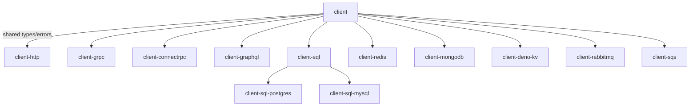

# Package Structure

Workspace organization and dependency management for Probitas Client.

## Directory Layout

```
probitas-client/
├── deno.jsonc                    # Root workspace config
├── packages/
│   ├── probitas-client/          # @probitas/client - Core package (shared types/errors)
│   ├── probitas-client-http/     # @probitas/client-http - HTTP client
│   ├── probitas-client-grpc/     # @probitas/client-grpc - gRPC client
│   ├── probitas-client-connectrpc/ # @probitas/client-connectrpc - ConnectRPC client
│   ├── probitas-client-graphql/  # @probitas/client-graphql - GraphQL client
│   ├── probitas-client-sql/      # @probitas/client-sql - SQL base client
│   ├── probitas-client-sql-postgres/ # @probitas/client-sql-postgres - PostgreSQL
│   ├── probitas-client-sql-mysql/ # @probitas/client-sql-mysql - MySQL
│   ├── probitas-client-redis/    # @probitas/client-redis - Redis client
│   ├── probitas-client-mongodb/  # @probitas/client-mongodb - MongoDB client
│   ├── probitas-client-deno-kv/  # @probitas/client-deno-kv - Deno KV client
│   ├── probitas-client-rabbitmq/ # @probitas/client-rabbitmq - RabbitMQ client
│   └── probitas-client-sqs/      # @probitas/client-sqs - AWS SQS client
└── compose.yaml                  # Docker Compose for integration tests
```

## Package Hierarchy



## Dependency Management

- **Package-level dependencies**: Each package manages its own dependencies in
  its `deno.json`, NOT in the workspace root `deno.jsonc`
- Root `deno.jsonc` only contains: workspace definition, shared dev dependencies
  (testing), and local path overrides for development
- **JSR protocol for internal deps**: Use `jsr:@probitas/client@^0` for
  dependencies on the core package
